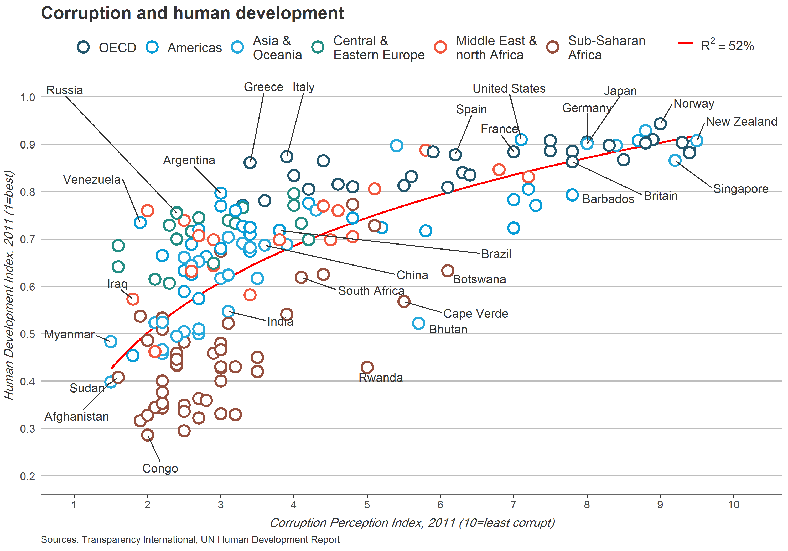

# R_CS_02
Data Visualization projects via ggplot2 in R (Story-Telling with Data)

## The first one
### Case-Study Title: Story Telling with Data (decision making and reasoning based-on data visualization)
### Data Analysis methodology: CRISP-DM
### Dataset: Sales data of a retail company in USA
### Case Goal: Comparing between Men & Women in each different cities, is there any difference of generating total revenue to company from gender aspect?

Plot without a story to tell!

Plot with a story to tell!

## The second one
### Case-Study Title: Story Telling with Data (decision making and reasoning based-on data visualization)
### Data Analysis methodology: CRISP-DM
### Dataset: Human Development Index and Corruption Perception Index scores for several countries (Economist magazine paper)
### Case Goal: Try to replicate CS_02_02_1.png: relation between corruption and human resources development index in each country

The Economist_Original.png plot

The Economist_Recreate.png plot

## The third one
### Case-Study Title: Story Telling with Data (decision making and reasoning based-on data visualization)
### Data Analysis methodology: CRISP-DM
### Dataset: research academic paper in economics (Harvard business review magazine)
### Case Goal: Try to replicate CS_02_03_1.png: compare distribution and mean of annual income levels of population in 3 class at two years

The income_original.png plot

The income_recreate.png plot

